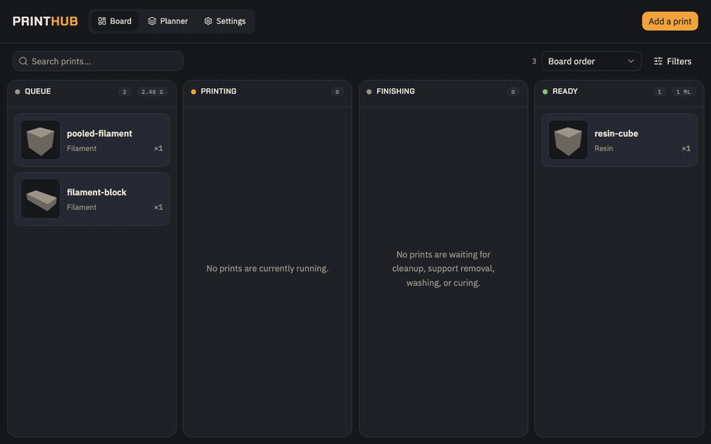

<div align="center">
  

# PrintHub

**A private 3D-print production queue for resin and filament printers, available self-hosted or as a managed service.**

[](https://github.com/richardsolomou/printhub/releases) [](https://github.com/richardsolomou/printhub/actions/workflows/docker.yml) [](LICENSE)

Collect STL requests, order the queue fairly, auto-assign compatible printers, and track every copy from **Queue → Up next → Printing → Finishing → Ready**.


</div>

## Who is it for? 👋

PrintHub replaces spreadsheets and chat threads with one queue, for:

- **Hobbyists** printing for friends who want requests, quantities, and progress out of their heads.
- **Print farms and small businesses** juggling more printers, more customers, and a growing backlog.

## How it works ✨

1. **Requesters upload models** with quantity, notes, and a preferred print type.
2. **You pick a queue order** — fair-by-requester, oldest first, whatever fits.
3. **PrintHub auto-assigns a compatible printer**, or an operator picks one manually.
4. **Your slicer handles the build** — orientation, arrangement, and supports.
5. **Each copy is tracked** through printing, finishing, and collection.

Along the way:

- Private workspaces with invites, social login, and two-factor authentication.
- Interactive STL previews, thumbnails, filtering, and drag-and-drop board controls.
- Mixed resin and filament fleets with dimension-aware auto-assignment.
- Local, S3-compatible, Dropbox, Google Drive, or OneDrive storage, with guided migration.
- Fair ordering, manual requester priorities, and withdrawal controls.
- Automatic migrations, backups, health checks, and optional email notifications.

## Self-hosted or managed 🔒

Run PrintHub as a single self-hosted appliance or a multi-tenant hosted service. Every workspace gets its own board, printers, members, and storage, and users can join other workspaces by invite.

Self-hosted keeps the app, database, files, and history under your control. Hosted workspaces must use S3-compatible or connected cloud storage (super-admin-created workspaces can still use local folders) — every storage location gets an enforced per-workspace namespace. PrintHub doesn't handle slicing or printer control, and there's no public gallery or marketplace.

Anonymous telemetry is on by default, never includes model or request data, and can be disabled anytime — see the [telemetry page](docs/telemetry.md) for exactly what's sent.

## Run it 🚀

```sh
docker run -d --name printhub \
  --user "$(id -u):$(id -g)" \
  --read-only --tmpfs /tmp:size=256m,mode=1777 \
  -p 3010:3000 \
  -v /path/to/appdata:/data \
  -v /path/to/prints:/prints \
  ghcr.io/richardsolomou/printhub:latest
```

Open `http://localhost:3010`. The first account created becomes the admin.

> Keep `/data` on a local filesystem. SQLite WAL databases should not be placed on NFS, SMB, or CIFS.

### Other installs

- **Docker Compose:** configure `docker-compose.yml` and `.env.example`, then run `docker compose up -d`.
- **TrueNAS SCALE / HexOS:** follow the [TrueNAS guide](deploy/truenas/README.md).
- **Unraid:** use [`deploy/unraid/printhub.xml`](deploy/unraid/printhub.xml).

## Configuration ⚙️

Workspace Settings covers printers, members, board behavior, and storage. Super Admin covers user accounts, auth providers, SMTP, telemetry, and diagnostics.

See the [deployment guide](docs/deployment.md) for environment variables, reverse proxy setup, health checks, backups, and upgrades.

## Storage and backups 💾

Local folders, WebDAV, S3-compatible services (Amazon S3, Backblaze B2, Cloudflare R2, DigitalOcean Spaces, Google Cloud Storage, MinIO), and connected Dropbox, Google Drive, or OneDrive accounts. Hosted users can also expose their own machine or NAS through Cloudflare Tunnel or Tailscale Funnel. Settings → Storage migrates files with progress reporting when you switch providers — see the [storage guide](docs/storage.md).

Back up `/data` and your model store together before upgrading — see the [deployment guide](docs/deployment.md) for backups, encryption keys, and restores.

Your slicer remains the source of truth for orientation, arrangement, supports, infill, and material use.

## Development 🛠️

Requires Node 24.x and pnpm 11.12.0. Setup, checks, and release guidance live in [CONTRIBUTING.md](CONTRIBUTING.md); see [SECURITY.md](SECURITY.md) for vulnerability reports and [GitHub Issues](https://github.com/richardsolomou/printhub/issues) for planned work.

## License

[MIT](LICENSE)
