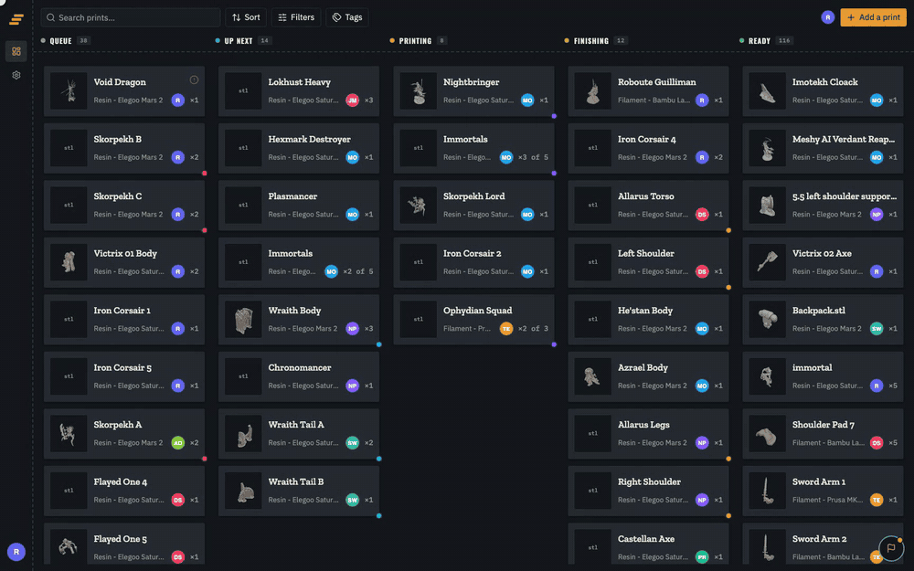

<div align="center">
  

# STL Quest

**A private 3D-print request and production queue for resin and filament printers.**

[stl.quest](https://stl.quest)

[](https://github.com/richardsolomou/stl.quest/releases) [](https://github.com/richardsolomou/stl.quest/actions/workflows/docker.yml) [](LICENSE)

Collect STL requests in one place, decide what to print next, match jobs to compatible printers, and track every copy from **Queue → Up next → Printing → Finishing → Ready**.


</div>

## Who is it for? 👋

STL Quest replaces scattered spreadsheets and chat threads with one shared queue. It is designed for:

- **Hobbyists** printing for friends who want a simple way to track requests, quantities, and progress.
- **Print farms and small businesses** juggling more printers, more customers, and a growing backlog.

## How it works ✨

1. **Requesters upload models** with quantity, notes, and a preferred print type.
2. **You choose the queue order** — balance work between requesters, print the oldest request first, or pick whatever fits.
3. **STL Quest auto-assigns a compatible printer**, or an operator picks one manually.
4. **Your slicer handles the build** — orientation, arrangement, and supports.
5. **Each copy is tracked** through printing, finishing, and collection.

Along the way:

- Private workspaces with invites, social login, and two-factor authentication.
- Interactive STL previews, thumbnails, filtering, and drag-and-drop board controls.
- Mixed resin and filament fleets with dimension-aware auto-assignment.
- Local, S3-compatible, Dropbox, Google Drive, or OneDrive storage, with guided migration.
- Fair ordering, manual requester priorities, and withdrawal controls.
- Automatic migrations, backups, health checks, and optional email notifications.

## Self-hosted or managed 🔒

Run STL Quest for one group on your own server, or host separate workspaces for several groups. Each workspace has its own board, printers, members, and storage. Users can join more than one workspace by invitation.

With self-hosting, you control the app, database, files, and history. Hosted workspaces use remote storage, with limited exceptions for super admins. See the [storage guide](docs/storage.md) for the full policy.

STL Quest does not slice models or control printers, and it does not include a public gallery or marketplace.

Anonymous telemetry is on by default, never includes model or request data, and can be disabled anytime — see the [telemetry page](docs/telemetry.md) for exactly what's sent.

## Run it 🚀

```sh
docker run -d --name stlquest \
  --user "$(id -u):$(id -g)" \
  --read-only --tmpfs /tmp:size=256m,mode=1777 \
  -p 30455:3000 \
  -v /path/to/appdata:/data \
  -v /path/to/prints:/prints \
  ghcr.io/richardsolomou/stl.quest:latest
```

Open `http://localhost:30455`. The first account created becomes the admin.

> Local SQLite is the default and `/data` should stay on a local filesystem. Set `DATABASE_URL` to use PostgreSQL instead.

### Other installs

- **Docker Compose:** configure `docker-compose.yml` and `.env.example`, then run `docker compose up -d`.
- **TrueNAS SCALE / HexOS:** [](https://apps.truenas.com/catalog/stlquest_community/)
- **Unraid:** [](https://ca.unraid.net/apps?q=STL-Quest)

See the [deployment guide](docs/deployment.md#platform-app-stores) for platform-specific installation notes and manual alternatives.

## Configuration ⚙️

Use **Workspace Settings** to manage printers, members, board behavior, and storage. Use **Super Admin** to manage user accounts, sign-in methods, email delivery, telemetry, and diagnostics.

See the [deployment guide](docs/deployment.md) for environment variables, reverse proxy setup, health checks, backups, and upgrades.

## Storage and backups 💾

Store models in a local folder, a WebDAV folder, S3-compatible storage, or a connected cloud account. **Settings → Storage** can migrate existing files when you switch providers. See the [storage guide](docs/storage.md) for supported services and setup instructions.

Back up `/data` and your model store together before upgrading — see the [deployment guide](docs/deployment.md) for backups, encryption keys, and restores.

Your slicer remains the source of truth for orientation, arrangement, supports, infill, and material use.

## Development 🛠️

Requires Node 24.x and pnpm 11.12.0. Setup, checks, and release guidance live in [CONTRIBUTING.md](CONTRIBUTING.md); see [SECURITY.md](SECURITY.md) for vulnerability reports and [GitHub Issues](https://github.com/richardsolomou/stl.quest/issues) for planned work.

## License

[GNU Affero General Public License v3.0](LICENSE)
